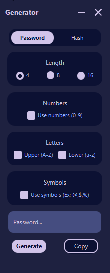
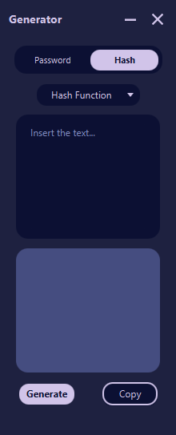

# Gerador de senhas e hashs

### Sobre
  

   Gerador de senhas que possibilita criar senhas de 4, 8 e 16 caracteres que podem ser números, letras ou símbolos.
  Gerador de hashs que utiliza o <a href="https://docs.oracle.com/javase/7/docs/api/java/security/MessageDigest.html"> MessageDigest</a> para gerar hashs
  com os algoritmos de criptografia MD2, MD5, SHA-1, SHA-256, SHA-384, SHA-512.
  

### Funcionaliadades
- [x] Gerar Senhas 
  - Escolher tipos de caracteres que compõe a senha (números, letras e símbolos)
  - Escolher o tamanho da senha 
  
- [x] Gerar Hashs
  - Escolher o algoritmo de criptografia (MD2, MD5, SHA-1, SHA-256, SHA-384, SHA-512).
  - Escrever mensagem que será criptografada.
- Validações
  - Gerador de Senhas
    - [ ] Verificar se um tipo de caractere foi escolhido.
  - Gerador de Hashs
    - [ ] Verificar se um algoritmo de criptografia foi escolhido.
  
- Gerador de Senhas 
  

    &nbsp;&nbsp;&nbsp;&nbsp;&nbsp;&nbsp;&nbsp;&nbsp;
  

- Gerador de Hash 
  

    
  

### Tecnologias e Ferramentas 
- <a href="https://www.oracle.com/java/technologies/javase/jdk17-archive-downloads.html" >Java JDK 17</a>
- <a href="https://gluonhq.com/products/javafx/" >Java FX 17</a>
- <a href="https://gluonhq.com/products/scene-builder/#download" >Scene Builder 17</a>

